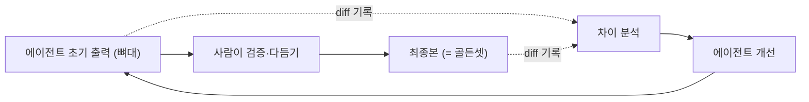

# 리서치 에이전트의 골든셋 평가 루프

생성형 리서치 에이전트는 정답이 하나로 떨어지지 않아 평가가 어렵습니다. 이 글은 별도의 평가 데이터셋을 인위적으로 구축하는 대신, 업무 과정에서 자연히 만들어지는 산출물을 골든셋으로 삼아 평가 루프를 돌린 방법을 정리한 것입니다. 특정 제품의 구현이 아니라, 리서치 에이전트를 운영하며 정착시킨 평가 패턴에 대한 기록입니다.

## 요약

- 리서치 에이전트의 출력은 완성품이 아니라 뼈대입니다. 정보가 정확한지, 구성이 적절한지는 사람이 확인해야 합니다.
- 사람이 다듬어 보고까지 마친 최종본을 골든셋으로 삼습니다.
- 에이전트의 초기 출력과 사람이 다듬은 최종본의 차이(diff)를 기록해 다음 개선에 반영합니다.
- 아키텍처 변경·이슈·실패 케이스를 따로 모아, 개발 변경이 있을 때마다 LLM에게 회귀 점검을 맡깁니다.
- 골든셋을 인위적으로 만들지 않아도, 정상적인 업무 흐름 속에서 평가 자산이 쌓입니다.

## 문제: 생성형 리서치 출력은 채점 기준이 모호하다

분류나 추출 같은 작업은 정답이 명확해서 자동 평가가 쉽습니다. 반면 리서치 에이전트가 만드는 산출물(어떤 주제에 대한 조사·요약·분석 문서)은 정답 문서가 하나로 존재하지 않습니다. 같은 질의에도 타당한 결과가 여러 개일 수 있고, 좋은 결과와 그럴듯하지만 부정확한 결과의 차이가 겉보기로는 잘 드러나지 않습니다.

그래서 두 가지가 어렵습니다. 무엇을 기준으로 채점할지 정하기 어렵고, 그 기준을 매번 새로 만들면 평가 자체가 큰 비용이 됩니다.

## 접근: 출력을 최종본이 아닌 뼈대로 본다

출발점을 바꿨습니다. 리서치 에이전트의 출력을 완성된 보고서가 아니라 뼈대로 규정하는 것입니다.

에이전트는 관련 정보를 모아 초안의 구조를 잡는 데까지를 담당합니다. 그다음 사람이 두 가지를 확인합니다. 하나는 뼈대가 정보를 정확히 가져왔는지(사실 검증), 다른 하나는 그 정보를 적절히 배치했는지(구성 검증)입니다. 사람이 이 검증과 다듬기를 거쳐 보고까지 마치면 그 결과물이 최종본이 됩니다.

이 관점의 장점은 사람의 개입이 평가를 위한 추가 노동이 아니라 원래 해야 하는 업무라는 점입니다. 평가 데이터를 따로 만드는 게 아니라, 일을 제대로 하는 과정에서 평가 자산이 함께 생깁니다.

## 핵심 루프: 초기 출력과 최종본의 차이를 반영한다

작동 방식은 이렇습니다.

1. 에이전트가 초기 출력(뼈대)을 만듭니다.
2. 사람이 사실과 구성을 검증하고 다듬어 최종본을 만듭니다.
3. 초기 출력과 최종본의 차이를 기록합니다. 사람이 무엇을 고쳤는지가 곧 에이전트가 놓친 지점입니다.
4. 이 차이를 다음 개선(프롬프트, 도구, 워크플로 조정)에 반영합니다.

여기서 최종본이 골든셋 역할을 합니다. 이 골든셋은 별도로 제작한 인공물이 아니라 실제로 쓰인 산출물이기 때문에 현실의 품질 기준을 그대로 반영합니다. 사람이 반복적으로 고치는 지점이 쌓이면 에이전트의 약점이 데이터로 드러납니다.

## 보조 루프: 변경 시 회귀 점검

핵심 루프와 별개로, 개발 과정에서 나온 지식도 평가 자산으로 모읍니다. 구체적으로는 다음을 한곳에 축적합니다.

- 아키텍처를 바꾼 결정과 그 이유
- 운영 중 마주친 이슈
- 실패했던 케이스

그리고 개발 변경이 있을 때마다 이 기록을 근거로 LLM에게 점검을 맡깁니다. 과거에 실패했던 케이스가 이번 변경으로 되살아나지 않았는지, 이전에 내린 설계 결정과 모순되지 않는지 확인하는 회귀 점검입니다. 사람이 모든 과거 케이스를 매번 되짚기는 어렵기 때문에 이 반복 점검을 LLM에게 위임합니다.

## 한계와 현재 상태

이 방법은 정교한 평가 프레임워크라기보다 업무 흐름에 평가를 얹은 실용적인 장치에 가깝습니다. 두 가지 한계가 있습니다.

- 아직 정량 지표로 정제되기 전 단계입니다. 차이를 기록하고 개선에 반영하는 루프는 돌지만, 이를 수치화된 스코어로 추적하는 체계는 미약합니다.
- 골든셋의 품질이 사람의 다듬기 품질에 종속됩니다. 검증하는 사람이 놓치면 그 오류가 골든셋에 그대로 남습니다.

그럼에도 이 방식이 유효했던 건, 평가를 위한 별도 비용을 거의 만들지 않으면서 개선 방향을 실제 데이터에 근거해 잡을 수 있었기 때문입니다.

## 배운 점

정답이 모호한 생성형 태스크에서는 완벽한 평가 기준을 처음부터 설계하려 하기보다, 실 서비스 피드백을 통해 이미 존재하는 검증 과정을 평가 루프로 바꾸는 편이 현실적이었습니다. 사람이 어차피 결과를 다듬는다면 그 다듬기의 흔적(diff)이 유용한 학습 신호가 됩니다.
