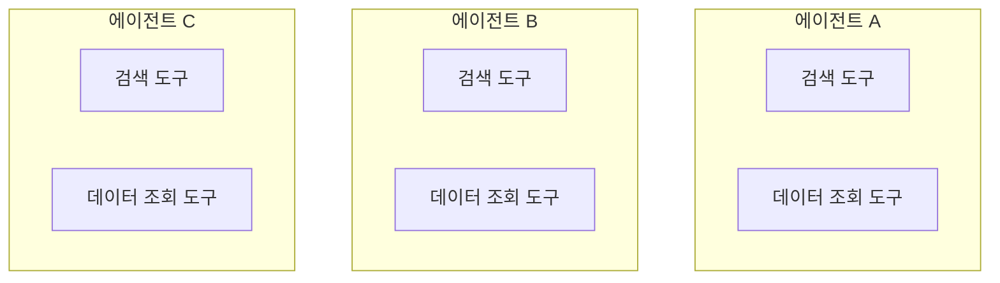
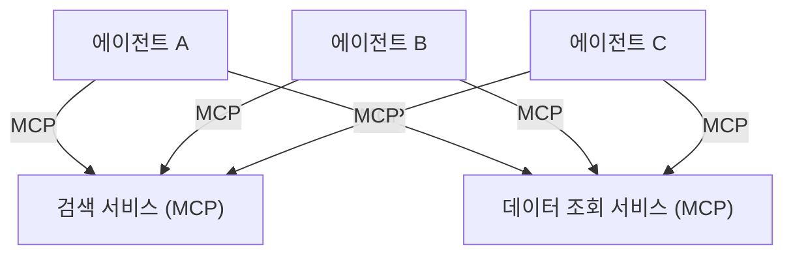

# 리서치 에이전트의 공통 도구를 MCP 서비스로 분리한 기록

여러 개의 리서치성 LLM 에이전트를 개발·운영하면서, 에이전트마다 중복으로 구현하던 검색·데이터 수집 도구를 독립 서비스로 분리하고 MCP(Model Context Protocol)로 접근하도록 바꾼 과정을 정리했습니다. 특정 제품의 구현이 아니라, 에이전트를 여러 개 다룰 때 반복해서 마주치는 설계 문제와 그 트레이드오프에 대한 기록입니다.

## 요약

- 처음엔 각 에이전트가 자체 도구(웹 검색, 기업·공시 정보 조회 등)를 프로젝트 안에 구현해서 도구 코드와 테스트가 에이전트 수만큼 복제됐습니다.
- 도구를 독립 서비스로 분리하고, 에이전트는 그 서비스를 MCP로 호출하는 구조(MSA)로 바꿨습니다.
- 단일 장애점이라는 비용을 감수하는 대신, 도구 품질을 한 곳에서 관리하고 도구 단위로 독립 검증할 수 있게 됐습니다.
- 도구를 신뢰할 수 있으니 새로 만드는 에이전트의 초기 품질이 좋아졌습니다.

## 배경: 도구가 에이전트마다 복제되는 문제

리서치성 에이전트는 대개 비슷한 도구를 필요로 합니다. 웹에서 최신 정보를 찾는 검색 도구, 정형화된 외부 데이터를 조회하는 도구 같은 것들입니다. 처음 에이전트를 하나씩 만들 때는 이 도구들을 각 프로젝트 안에 함께 두는 게 자연스러웠습니다. 첫 에이전트에서 도구를 만든 프롬프트와 코드를 다음 에이전트에 복사해 재사용하는 식이었습니다.

에이전트가 한두 개일 때는 문제가 없었지만, 관리하는 에이전트가 늘면서 세 가지가 반복 비용으로 돌아왔습니다.

첫째, 같은 도구를 여러 번 만들게 됩니다. 검색 도구 하나를 개선해도 그 개선이 다른 에이전트에 자동으로 반영되지 않습니다. 복사본이 프로젝트마다 조금씩 갈라집니다.

둘째, 같은 테스트를 매번 반복합니다. 특히 검색 도구는 조용히 품질이 나빠지기 쉽습니다. 결과가 실제로 관련성 있는지, 요청한 기간과 다른 시점의 정보가 섞여 오지 않는지, 반환된 URL이 아직 살아 있는지 확인해야 합니다. 이런 검증을 프로젝트마다 새로 짜서 돌리고 있었습니다.

셋째, 품질의 기준선이 에이전트마다 다릅니다. 잘 다듬어진 도구를 가진 에이전트가 있는가 하면, 급하게 복사해 온 도구는 검증이 얕았습니다. 같은 종류의 작업인데 신뢰도가 제각각이었습니다.

## 설계: 도구를 서비스로 분리하고 MCP로 접근

핵심은 단순합니다. 도구를 에이전트에서 떼어내 각각 독립된 서비스로 올리고, 에이전트는 그 서비스를 MCP로 호출합니다. 도구는 더 이상 에이전트의 일부가 아니라 여러 에이전트가 공유하는 외부 자원이 됩니다.

### 변경 전: 모놀리식 도구

같은 도구가 에이전트마다 복제되어 있습니다. 개선과 테스트도 그만큼 복제됩니다.

### 변경 후: 공유 MCP 서비스

도구는 한 벌만 존재하고, 모든 에이전트가 같은 서비스를 바라봅니다.

## 트레이드오프: 단일 장애점을 감수한 이유

이 구조에는 분명한 비용이 있습니다. 도구 서비스 하나가 죽으면 그 도구를 쓰는 모든 에이전트가 함께 영향을 받습니다. 모놀리식 구조에서는 한 에이전트의 도구가 고장 나도 다른 에이전트는 멀쩡했지만, 이제는 검색 서비스가 내려가면 검색에 의존하는 에이전트 전부가 흔들립니다.

그럼에도 분리를 택한 건 이 비용이 관리 가능한 종류의 위험이기 때문입니다. 장애 지점이 한 곳으로 모이면 감시와 복구도 한 곳에 집중할 수 있습니다. 반대로 품질 문제는 조용히 여러 곳에 흩어져 쌓이기 때문에 다루기가 더 어렵습니다. 눈에 잘 띄는 가용성 위험과 눈에 안 띄는 품질 부채를 맞바꾼 셈인데, 리서치 도구에서는 후자가 더 부담이 컸습니다.

## 부수 효과: 도구를 MCP화하니 독립 검증이 쉬워졌다

분리하고 나서 크게 체감한 이점은 재사용보다 테스트 가능성이었습니다.

도구가 에이전트 안에 묻혀 있을 때는 도구만 따로 떼서 평가하기가 번거로웠습니다. 도구를 독립 서비스로 만들고 MCP 인터페이스를 붙이자, 각 도구를 에이전트와 분리해 단독으로 호출하고 검증할 수 있게 됐습니다. 코딩 에이전트 환경에서 도구를 MCP로 노출해두면 LLM-as-a-Judge 방식으로 테스트 케이스를 구성해 도구의 출력을 반복적으로 채점하기도 좋았습니다.

검색 도구를 예로 들면, 다음과 같은 점검을 도구 서비스 단에서 한 번만 제대로 만들어두면 됩니다.

- 반환된 정보가 질의와 관련이 있는지
- 요청한 기간과 결과의 시점이 어긋나지 않는지
- 반환된 URL이 유효한지

예전에는 이 검증을 에이전트마다 다시 짰지만, 이제는 도구 서비스가 품질을 책임지고 에이전트는 그 결과를 신뢰하고 받아 씁니다.

## 결과: 신규 에이전트의 초기 품질이 올라갔다

도구가 안정된 공유 자원이 되면서, 새 에이전트를 만들 때 도구에 관해서는 처음부터 신뢰할 수 있는 상태로 시작하게 됐습니다. 새 에이전트는 도구를 다시 만들거나 검증할 필요 없이 이미 검증된 서비스를 연결하기만 하면 됩니다. 그 결과 신규 에이전트의 초기 완성도가 이전보다 높아졌고, 개발 초반에 도구 품질 때문에 흔들리는 일이 줄었습니다.

## 배운 점

이 작업에서 크게 남은 건 개발 순서에 대한 감각입니다. 먼저 전체 아키텍처의 뼈대를 잡고, 그다음 그 안의 내용을 정교하게 채우는 편이 나았습니다. 도구를 어디에 둘 것인가(뼈대)를 초반에 결정하지 않으면, 각 에이전트를 열심히 다듬을수록 중복과 불일치라는 부채가 오히려 커졌습니다.

도구를 공유 서비스로 분리한 것이 뼈대에 해당했고, 각 도구의 검증 로직을 촘촘히 만든 것이 내부를 채우는 작업이었습니다. 이 순서가 바뀌어 뼈대 없이 내부부터 채우면 나중에 구조를 되돌리는 비용이 커집니다.
